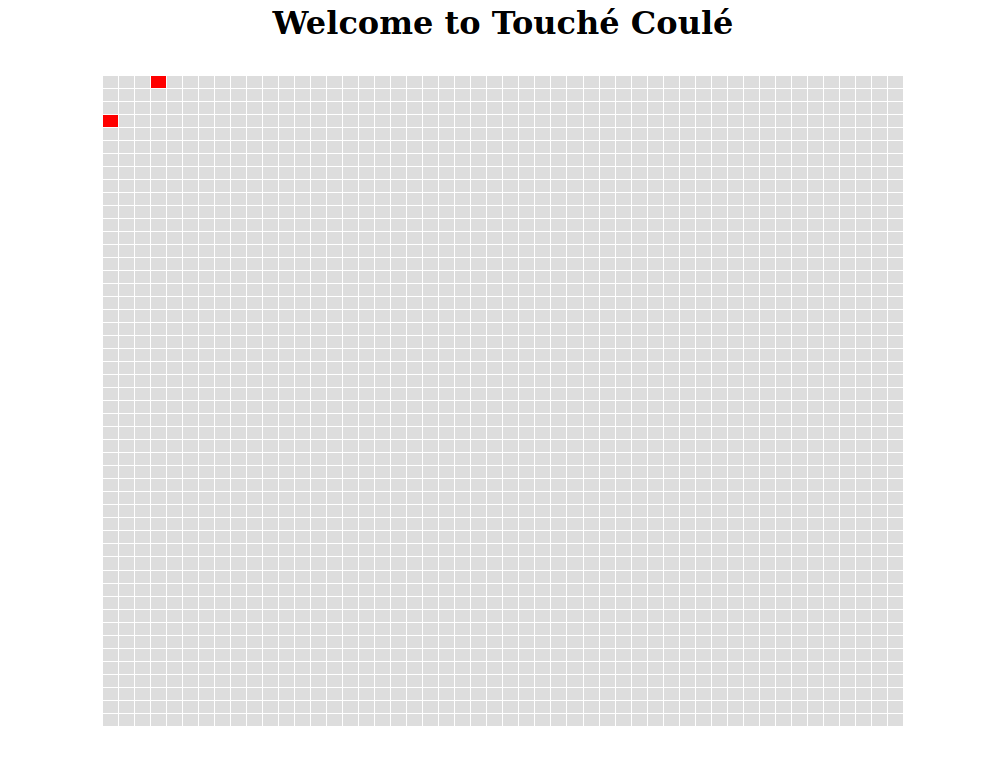
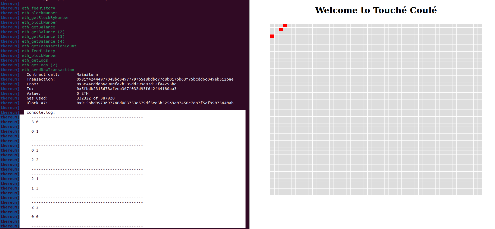

# Touché Coulé

Welcome to the DAAR project. The idea will be to implement a "Touché Coulé" (Battleship) game
in a decentralized way, on Ethereum. This will have cool side effects, like not
be forced to pay for servers.
The project can't be run on Windows. Please, use WSL.

This project was made by the students of M2 RES INSTA (All authors contributed equally to this work):
- BOUDIAF Anis 
- BOUKERRAS Nedir Nour El Amine
- MATARI Mohamed

Suprived by:
- HIVERT Guillaume  
# Configuration
We wrote this shell script that will install all the necessary depandancies:
```bash
#!/bin/sh
sudo apt install hardhat
sudo apt update
sudo apt install curl git
curl -fsSL https://deb.nodesource.com/setup_18.x | sudo -E bash -
sudo apt-get install -y nodejs
sudo apt install cmdtest 
sudo apt-get install -y nodejs
sudo apt update 
sudo apt upgrade 
sudo apt install nodejs npm
cd touche-coule/
sudo apt install npm
npm install --save-dev hardhat
sudo apt install nodejs
sudo apt install cmdtest
curl -sS https://dl.yarnpkg.com/debian/pubkey.gpg | sudo apt-key add -
echo "deb https://dl.yarnpkg.com/debian/ stable main" | sudo tee /etc/apt/sources.list.d/yarn.list
sudo apt update
sudo apt install yarn
yarn
yarn dev
```

# Implementation

For the implementation, we modified 3 files: Main.sol, Ship.sol and App.tsx.

## ```Main.sol```
Overriding the function register as following:
```c
 function register() external {
    myShip Ship1 = new myShip();
    address ship;
    ship = address(Ship1);
    require(count[msg.sender] < 2, 'Only two ships');
    require(!used[ship], 'Ship alread on the board');
    require(index <= game.height * game.width, 'Too much ship on board');
    count[msg.sender] += 1;
    ships[index] = ship;
    owners[index] = msg.sender;
    (uint x, uint y) = placeShip(index);
    Ship(ships[index]).update(x, y);
    emit Registered(index, msg.sender, x, y);
    used[ship] = true;
    index += 1;
  }

```
We omit the input parameter of the function and we include it in the body of the function by adding the first 3 lines:
```c
    myShip Ship1 = new myShip();
    address ship;
    ship = address(Ship1);
```
Here, it will create an object of type myShip (described in the file Ship.sol):
- ```c
    myShip Ship1 = new myShip();
  ```

Then, we will get the address of the ship we created:
- ```c
     address ship;
  ```


Here we will assign the address to the local variable ship:
- ```c
    ship = address(Ship1);
  ```


## ```App.tsx```
In the Buttons section of the code (line 132), we created a variable called register as following :

```tsx
const register = () => wallet?.contract.register()
```
And we will call this constant at the onClick of the button Register as following:
```tsx
<button onClick={register}>Register</button>
```


## ```Ship.sol```
We will inherit from the Ship contract as following:
```bash
contract myShip is Ship
```
The contract myShip will override the place() and fire() functions of the Ship contract with a particular strategy.

We added few global variables that will be important in the good execution of the place() and fire() functions:
```c
  //self postion
  uint my_postion_x; 
  uint my_postion_y;


  //declaration of arrays
  uint[] values_of_x;
  uint[] values_of_y;
 
 //var used for random
 uint randNonce = 0;
 
```
We implemented features that will allow the ship to play in a smart way.

### ```place()```
The strategy of the place() function is as following:

First, we generate 2 randoms coordinates that depend on two different timestamps, two integers and the contract's address.

Second, we use two arrays to store the coordinates to make sure a ship will not fire on its own position.
```js
  function place(uint width, uint height) public override virtual returns (uint, uint){
    // Initializing the state variable
    randNonce+=1;
    // Postisions
    uint x;
    uint y;
    // x = random between 0 and 49
    x=uint(keccak256(abi.encodePacked(block.timestamp,msg.sender,randNonce))) % 50;
    randNonce+=1;
    // y = random between 0 and 49
    y=uint(keccak256(abi.encodePacked(block.timestamp,msg.sender,randNonce))) % 50;
    // init array with the position of the ship
    values_of_x.push(x);
    values_of_y.push(y);
    // store the position of the ship
    my_postion_x=x;
    my_postion_y=y;
    // return the values of x and y to the place function
    return(x,y);
    }
```


### ```fire()```
The strategy of the fire() function is as following :

First, we have two arrays that will store the x and y positions so that the ship will not fire twice in the same position. Same as the function place, we will generate two randoms for the x and y positions but in the fire function and at every generation of randoms, it will verify that x and y were not already picked.

Second and after generating two randoms x and y that were not in the list of the positions that the ship already fired in, we will push those positions in the arrays and we will return them to the fire() function.

Note: as the button Turn engage all the ships to fire, we added a variable called ```sel``` to be added in the timestamp to the random function so two ships won't have necessarily the same seed for this random function.
```js
  function fire() public override virtual returns (uint, uint){   
    // Initializing the state variable
    randNonce+=1;
    // Postisions to fire
    uint x;
    uint y;
    //sel
    uint sel;
    sel=(my_postion_x+my_postion_y)*my_postion_x+my_postion_y;
    // x = random between 0 and 49
    x=uint(keccak256(abi.encodePacked(block.timestamp+sel,msg.sender,randNonce))) % 50;
    randNonce+=1;
    // y = random between 0 and 49
    y=uint(keccak256(abi.encodePacked(block.timestamp+sel,msg.sender,randNonce))) % 50;
    //index for both the arrays values_of_x and values_of_y
    uint i=0;
    //loop to verify if the x and y arn't already in the arrays
    while(i < values_of_x.length)
      {  
      //if x and y are in the arrays re generate random
      while(x == values_of_x[i] && y == values_of_y[i]){
        randNonce+=1;
        // x = random between 0 and 49
        x=uint(keccak256(abi.encodePacked(block.timestamp+sel,msg.sender,randNonce))) % 50;
        randNonce+=1;
        // y = random between 0 and 49
        y=uint(keccak256(abi.encodePacked(block.timestamp+sel,msg.sender,randNonce))) % 50;
        //if ever a regeneration, make the index back to zero
        i=0; //so important
        }
        //moveing forward in the arrays
        i+=1;
      
      }
    
    //everytime if fires add them to arrays
    values_of_x.push(x);
    values_of_y.push(y);
    //print where it fires in the terminal
    console.log("-----------------------------------------------");
    for(i=0;i<values_of_x.length;i+=1)
    {
      console.log("%d %d\n",values_of_x[i],values_of_y[i]);
    }
    console.log("-----------------------------------------------");
    //fire at x and y
    return(x,y);
    }
```


# Test scenario
For the test scenario and in order to have a fairly short game for the sake of demonstration, we put our ships on a game board of 4x4 (replacing %50 with %4).

We will have two players, each player will have two ships, as a player is a metamask account (each account is a private key given by the ouput of the yarn dev command to have 10000 ETH in the wallet).

At the beginning of the game, the first player will register his two ships with the button register (one click of a button for each ship):



The second player will register his two ships with the button register (one click of a button for each ship):


Once the two players registered their ships, the game can start by clicking on the Turn button from any player account, we will also print the different ships's postions of their fire in the terminal:



In the console.log (in the left of the screenshot), we can notice that the first ship registered his position in his array (3,0) and where it fired (0,1) and the same for every other ship.

Here we can notice that the ship number 2 fired the ship number 4 (see console.log in the left).

We will continue the game (by clicking on the Turn button):


Untill having one ship:


This ship is the winner!!! 🥇️
